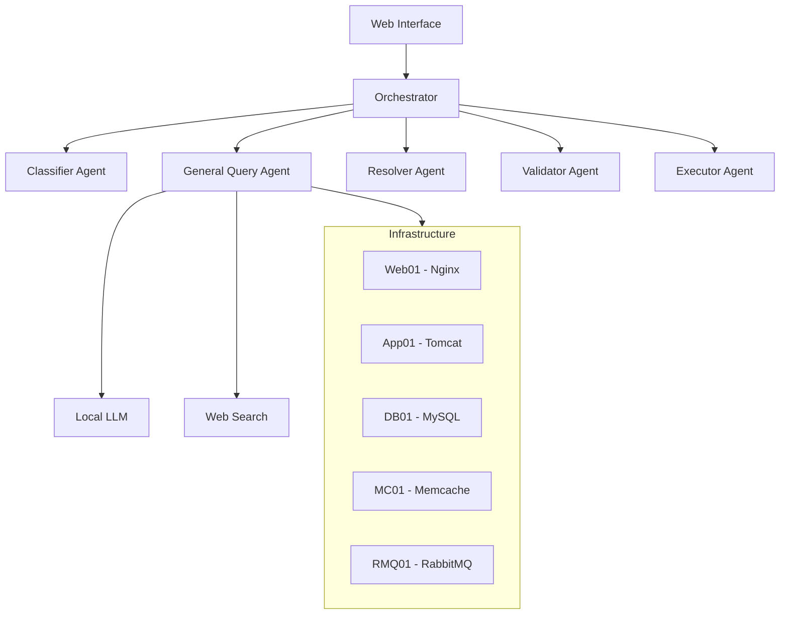

# AI-Powered IT Support Platform

An intelligent, automated IT support system that combines infrastructure management, knowledge base capabilities, and AI-driven problem resolution.

## Features

### 1. Multi-Agent System
- **Classifier Agent**: Intelligently categorizes user queries and issues
- **General Query Agent**: Handles infrastructure status and knowledge-based queries
- **Resolver Agent**: Generates detailed resolution plans for issues
- **Validator Agent**: Ensures safety and effectiveness of proposed solutions
- **Executor Agent**: Safely implements approved solutions

### 2. Query Types
- **Infrastructure Queries**: Monitor and manage system status, logs, and metrics
- **Knowledge Queries**: Get answers to general IT questions using web search
- **API Queries**: Access documentation and integration details for various services
- **Problem Resolution**: Automated troubleshooting and fix implementation

### 3. Infrastructure Management
- Multiple VM support
- Preconfigured services:
  - Web Server (Nginx)
  - Application Server (Tomcat)
  - Database (MySQL)
  - Caching (Memcache)
  - Message Queue (RabbitMQ)

### 4. Modern Web Interface
- Responsive Bootstrap-based UI
- Dark mode support
- Real-time query responses
- Interactive resolution approval workflow
- Markdown rendering for documentation
- Timeline view for execution results

## Technical Stack

### Backend
- Python 3.x
- Flask web framework
- Langchain for LLM integration
- Ollama/Mistral for local LLM processing
- DuckDuckGo API for web searches

### Frontend
- Bootstrap 5
- Font Awesome icons
- Showdown.js for Markdown rendering
- Modern JavaScript (ES6+)

### Infrastructure
- Vagrant for VM management
- Infrastructure as Code (IaC)
- SSH-based remote command execution
- JSON-based configuration

## Setup

1. **Clone the Repository**
   ```bash
   git clone <repository-url>
   cd Autonomous-IT-Support-Agent
   ```

2. **Install Dependencies**
   ```bash
   pip install -r requirements.txt
   ```

3. **Configure Infrastructure**
   - Update `infra_config.json` with your VM configurations
   - Ensure Vagrant is installed
   - Run the infrastructure setup:
     ```bash
     cd Local_infra_setup_script_IaC
     vagrant up
     ```

4. **Configure Environment**
   - Set up Ollama with Mistral model
   - Configure logging (optional)
   - Update API keys if needed

5. **Start the Application**
   ```bash
   python app.py
   ```

## Usage

### 1. Infrastructure Queries
```
"Show me the status of nginx on web01"
"What's the CPU usage on app01?"
"Check MySQL logs on db01"
```

### 2. Knowledge Queries
```
"What is the difference between Docker and Kubernetes?"
"Explain how load balancing works"
"Best practices for database backup"
```

### 3. API Queries
```
"Show me ServiceNow API endpoints"
"How to integrate with Ansible Tower API"
"Documentation for RabbitMQ REST API"
```

### 4. Problem Resolution
```
"Nginx is returning 502 errors"
"MySQL keeps crashing on db01"
"High memory usage on app01"
```

## Architecture



## Security

- SSH key-based authentication for infrastructure access
- Input validation and sanitization
- Execution approval workflow
- Rollback capabilities for failed operations
- Comprehensive logging and audit trail

## Contributing

1. Fork the repository
2. Create a feature branch
3. Commit your changes
4. Push to the branch
5. Create a Pull Request

## License

This project is licensed under the MIT License - see the LICENSE file for details.

## Acknowledgments

- Langchain for LLM integration
- Ollama/Mistral for local LLM capabilities
- DuckDuckGo for web search functionality
- Bootstrap team for the UI framework