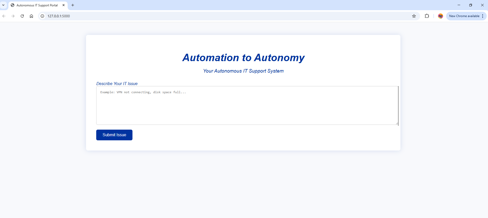
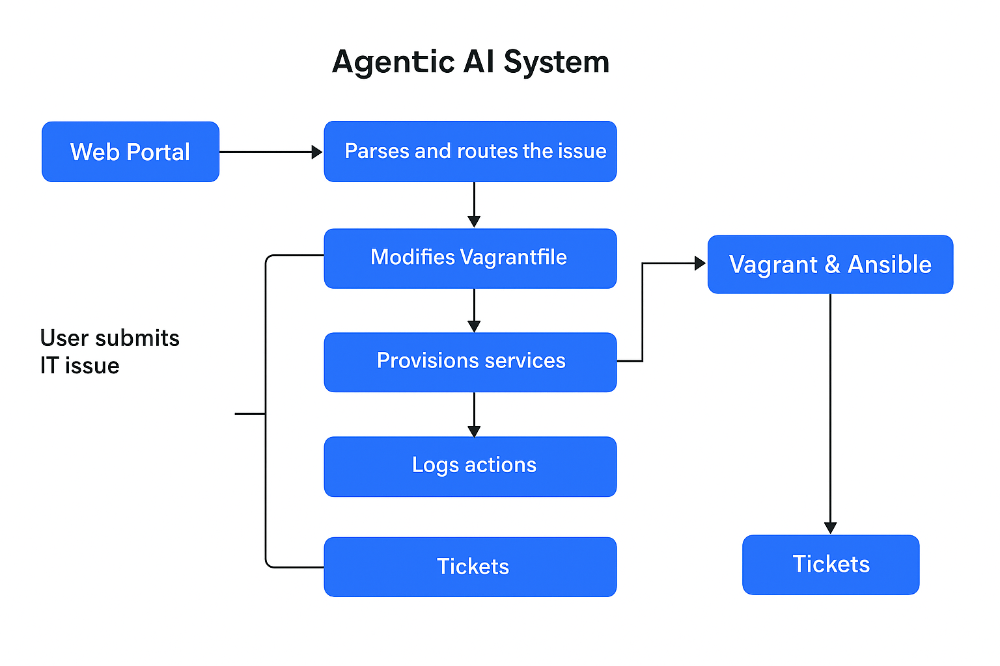
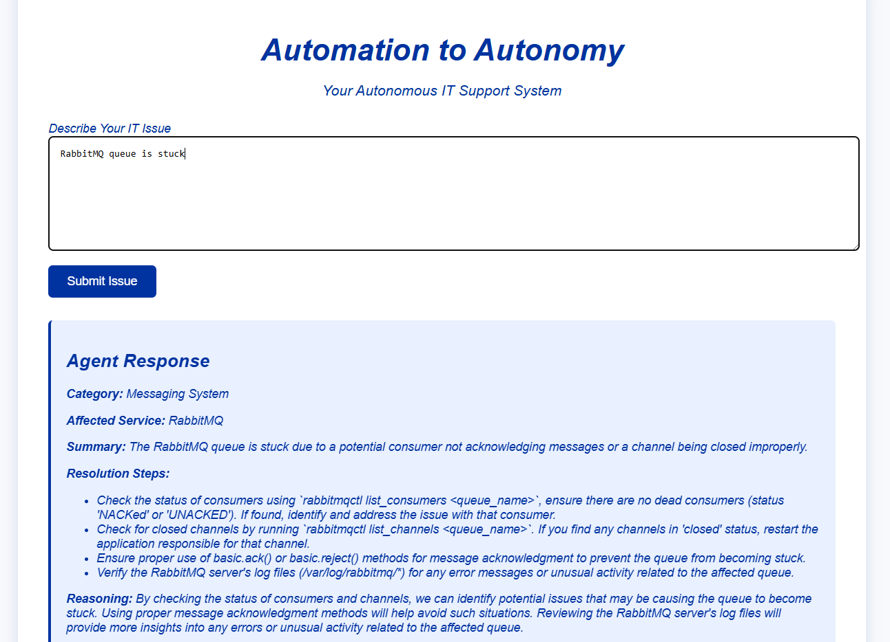
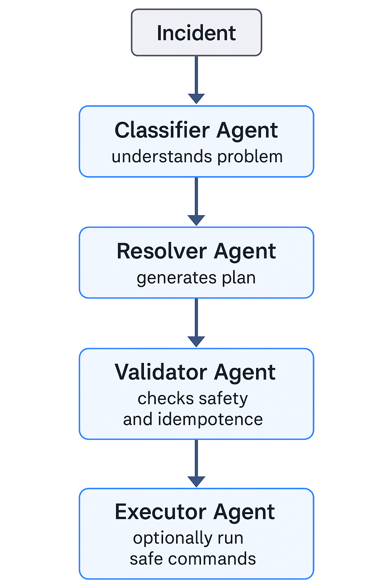
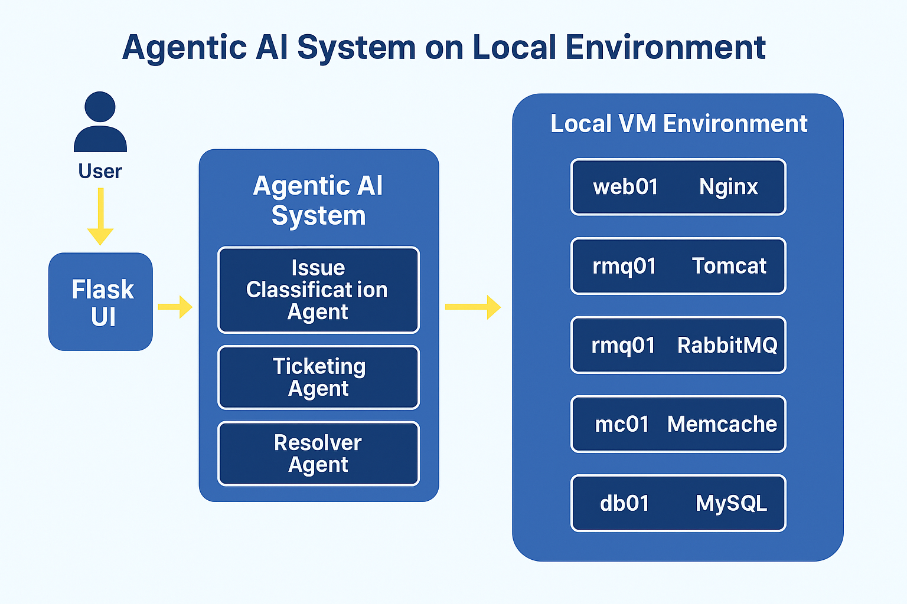
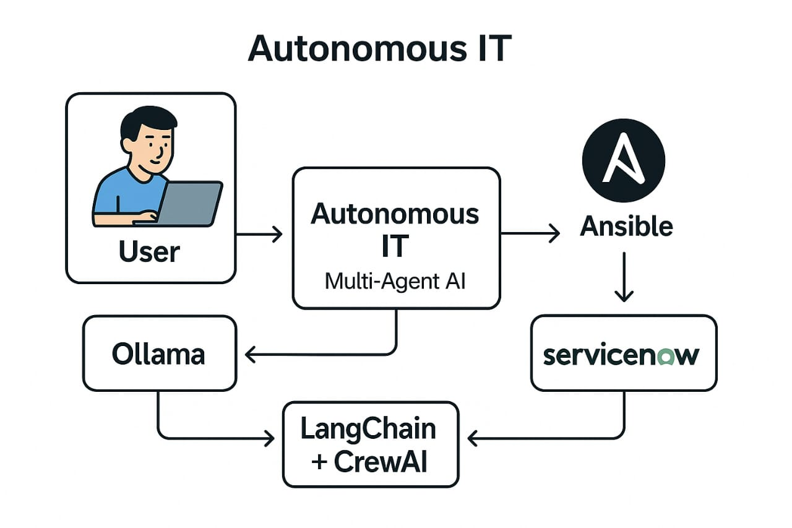

# Autonomous IT Support Agentic AI System

**Automation to Autonomy: Autonomous IT Support Portal**

This system is designed to automate IT support operations by providing users with an intelligent, autonomous agent to classify, triage, and resolve IT issues based on predefined categories. The system utilizes **LLM-powered agents** (Ollama, CrewAI, LangChain) to handle IT issues through a web-based portal.



## Features

* **Intelligent Issue Detection and Classification**: Classifies IT issues into predefined categories such as **VPN issues**, **Disk Cleanup**, **Network Connectivity**, etc.
* **Autonomous Issue Resolution**: Generates appropriate solutions based on the classification.
* **Infra Provisioning**: Automatically provisions infrastructure using **Ansible**, with services like **MySQL**, **Memcache**, **RabbitMQ**, **Tomcat**, **Elasticsearch**, and **Nginx**.
* **File-Based Ticketing**: Issues are logged with timestamps and categories into a **JSON file** for tracking and analysis.
* **Modular Agent System**: Utilizes agents like **Issue Classification**, **Ticket Logging**, **Resolution Generation**, and **Infra Provisioning** to maintain separation of concerns.

## Architecture Overview



The system is based on the following key components:

1. **Web Interface (Flask UI)**:

   * Users submit IT issues through a form on a clean, professional interface.
   * Uses Pantone 293 blue and Helvetica for design, providing a modern and user-friendly experience.
  
  

1. **Agentic AI System**:

   * **Issue Classification Agent**: Analyzes the submitted issue and classifies it into categories.
   * **Ticketing Agent**: Logs issues with timestamps in a JSON format, mimicking ServiceNow.
   * **Resolution Agent**: Generates possible resolutions or troubleshooting steps for the issue.
   * **Infra Provisioning Agent**: Handles automated infrastructure provisioning via Ansible and Vagrant for MySQL, Memcache, RabbitMQ, Tomcat, Elasticsearch, and Nginx.
  
  

2. **Language Model Integration**:

   * **Ollama**, **LangChain**, and **CrewAI** are integrated to handle NLP tasks and act as the decision engine for agents.

3. **Logging and Monitoring**:

   * Each agent interaction is logged in a JSON file with detailed metadata (issue type, timestamp, agent actions, etc.)

## Technologies

* **Flask**: Web framework for creating the portal and handling requests.
* **Python**: For back-end logic and agent integrations.
* **Ansible**: Automates infrastructure provisioning.
* **Ollama**: Language model for issue detection and classification.
* **LangChain**: Helps integrate with agents and language models.
* **CrewAI**: An additional layer for managing agent flows and interactions.
* **Vagrant**: Creates virtual machine environments to provision the services.

## Setup Instructions

### Prerequisites

1. **Python 3.x**:
   Ensure you have Python installed on your system.

   ```bash
   python --version
   ```

2. **Ansible**:
   Install Ansible for automating the infrastructure provisioning.

   * For Ubuntu:

     ```bash
     sudo apt update
     sudo apt install ansible
     ```

3. **Vagrant**:
   Install Vagrant for managing virtual machine environments.

   * Download and install from [Vagrant Downloads](https://www.vagrantup.com/downloads).

4. **Flask and other Dependencies**:
   Install Flask and other dependencies using `requirements.txt`.

   ```bash
   pip install -r requirements.txt
   ```

### File Structure

├── Infra_setup_script_IaC/
│   ├── Vagrantfile
│   ├── mysql.yml
│   ├── memcache.yml
│   ├── rabbitmq.yml
│   ├── tomcat.yml
│   ├── elasticsearch.yml
│       └── nginx.yml
├── agents/
│   ├── issue_classifier_agent.py
│   ├── ticketing_agent.py
│   ├── resolver_agent.py
│   ├── infra_provision_agent.py
│   └── adhoc_agent.py
├── static/
│   └── style.css
├── templates/
│   └── index.html
├── tickets/
│   └── ticket.json
├── app.py
├── agents_manager.py
├── langchain_setup.py
├── requirements.txt
└── README.md

### Steps to Run the System

1. **Setup Flask UI**:

   * Run the Flask application using:

     ```bash
     python app.py
     ```

2. **Configure Ansible and Vagrant**:

   * Initialize your VMs by running Vagrant.

     ```bash
     vagrant up
     ```
   * Ensure that the Ansible playbooks for MySQL, Memcache, RabbitMQ, Tomcat, Elasticsearch, and Nginx are correctly set up to provision the services.

### 🖥️ Local Infrastructure Setup (IaC Script)



To simplify the provisioning process, a setup script is available in the `Local_infra_setup_script_IaC` directory. This script is designed to automate the creation and configuration of all required infrastructure components via a single command.

📁 Path: `Local_infra_setup_script_IaC/`

📜 Command to run:

```bash
vagrant up
```

This command will automatically:

- Spin up Vagrant-managed virtual machines
- Use bash script to provision the following services:
  - MySQL
  - Memcache
  - RabbitMQ
  - Tomcat
  - Elasticsearch
  - Nginx

🛠️ Infrastructure Summary:

The infrastructure consists of virtual machines configured to host commonly used services in enterprise environments. Each VM is provisioned with one or more of the following:

| Service         | Description                                           |
|-----------------|-------------------------------------------------------|
| MySQL           | Open-source relational database for structured data  |
| Memcache        | In-memory key-value store for caching                |
| RabbitMQ        | Message broker for async communication                |
| Tomcat          | Java servlet container for web apps                  |
| Elasticsearch   | Full-text search and analytics engine                |
| Nginx           | Web server and reverse proxy                         |

This setup is ideal for testing and validating the full autonomous IT support flow on a local development machine without the need for manual configuration.


## Future Plans



* **Scaling**: Introduce dynamic scaling of services based on demand.
* **ServiceNow Integration**: Integrate with an actual ServiceNow system for better ticket management.
* **Advanced NLP**: Further enhance the language models for better understanding and response quality.
* **User Authentication**: Implement secure authentication for users accessing the portal.

## License

This project is open-source and available under the [MIT License](LICENSE).

---