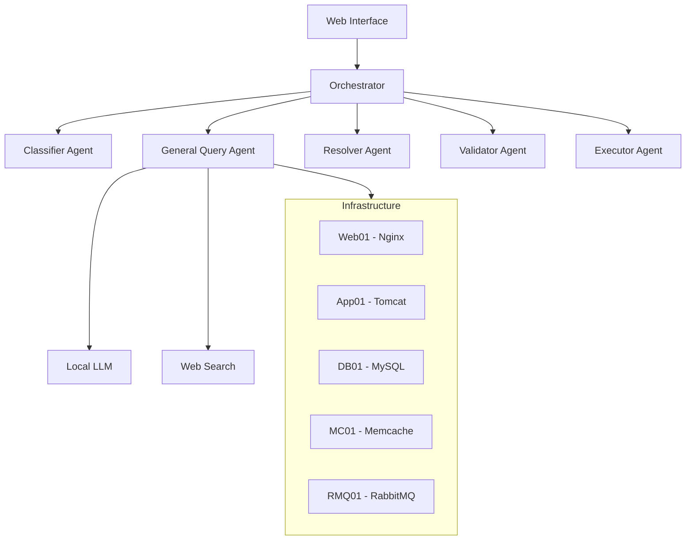

# Autonomous IT Support Agent

A robust, extensible, and secure AI-powered IT support platform for infrastructure monitoring, troubleshooting, and automation.

## Features
- Modular plugin architecture for services and commands
- Secure command execution (whitelisting, RBAC, audit logging)
- Automated and interactive troubleshooting
- API documentation and integration knowledge base
- Real-time health dashboard and alerting
- Asynchronous, scalable job execution
- LLM-powered remediation and knowledge queries

## Project Structure
- `core/` - Core logic (command execution, security, logging)
- `plugins/` - Service and command plugins
- `api/` - REST API endpoints
- `ui/` - Frontend dashboard
- `config/` - Infrastructure, RBAC, and command configs

## Setup
1. Clone the repo
2. Install requirements: `pip install -r requirements.txt`
3. Configure infrastructure and RBAC in `config/`
4. Run the backend: `python api/main.py`
5. Open the dashboard in your browser

## Extending
- Add new services/commands as plugins in `plugins/`
- Update RBAC and command templates in `config/`

## Security
- All actions are logged
- Only whitelisted commands can be executed
- Role-based access control for sensitive actions

## Technical Stack

### Backend
- Python 3.x
- Flask web framework
- Langchain for LLM integration
- Ollama/Mistral for local LLM processing
- DuckDuckGo API for web searches

### Frontend
- Bootstrap 5
- Font Awesome icons
- Showdown.js for Markdown rendering
- Modern JavaScript (ES6+)

### Infrastructure
- Vagrant for VM management
- Infrastructure as Code (IaC)
- SSH-based remote command execution
- JSON-based configuration

## Usage

### 1. Infrastructure Queries
```
"Show me the status of nginx on web01"
"What's the CPU usage on app01?"
"Check MySQL logs on db01"
```

### 2. Knowledge Queries
```
"What is the difference between Docker and Kubernetes?"
"Explain how load balancing works"
"Best practices for database backup"
```

### 3. API Queries
```
"Show me ServiceNow API endpoints"
"How to integrate with Ansible Tower API"
"Documentation for RabbitMQ REST API"
```

### 4. Problem Resolution
```
"Nginx is returning 502 errors"
"MySQL keeps crashing on db01"
"High memory usage on app01"
```

## Architecture



## License

This project is licensed under the MIT License - see the LICENSE file for details.

## Acknowledgments

- Langchain for LLM integration
- Ollama/Mistral for local LLM capabilities
- DuckDuckGo for web search functionality
- Bootstrap team for the UI framework